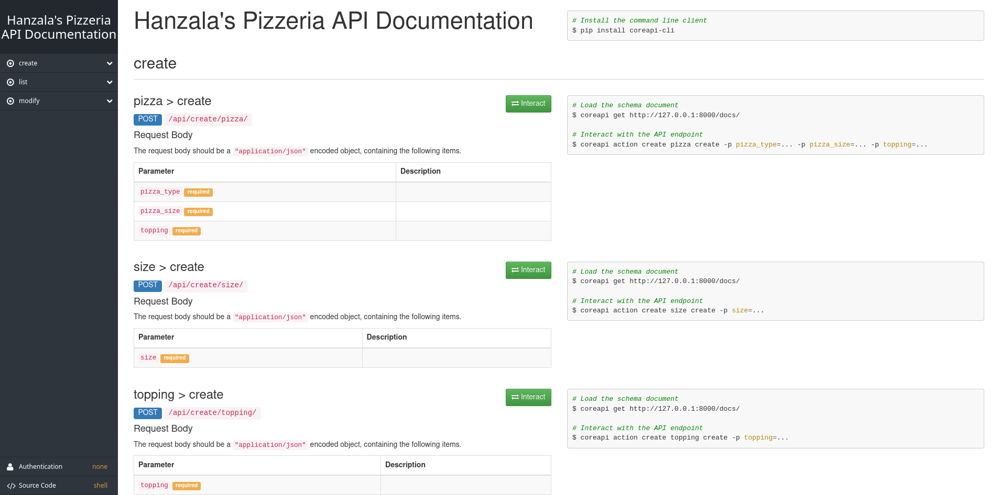

# pizzeria

API for creating pizza orders and much more.



## Steps to run a local server

1. Install the required modules
   ```shell
    pip install -r requirements.txt
    ```
2. Make migrations
    ```shell
    python manage.py makemigrations pizza
    ```
3. Apply migrations
    ```shell
    python manage.py migrate
    ```
4. Run server
    ```shell
    python manage.py runserver
    ```
5. Go to http://127.0.0.1:8000/docs for testing the APIs.


## API Info

1. **create**
    <details><summary><ins>pizza > create</ins></summary>
    
    - POST `/api/create/pizza/`
    
        | Parameter  | Description |
        | ------------- | ------------- |
        | `pizza_type` **(required)** | Type of pizza (*i.e.* regular or square)  |
        | `pizza_size` **(required)** | Size of pizza (*e.g.* small, medium, large, etc.)  |
        | `topping` **(required)**    | Topping on the pizza (*e.g.* tomato, onion, cheese, corn, etc.)|
    
    - **Example**
        ```shell
        # Load the schema document
        coreapi get http://127.0.0.1:8000/docs/
        
        # Interact with the API endpoint
        coreapi action create pizza create -p pizza_type="Regular" -p pizza_size="Large" -p topping='["Tomato","Cheese"]'
        ```
    
    - **Result**
        ```json
        {
            "id": 5,
            "pizza_type": "Regular",
            "pizza_size": "Large",
            "topping": [
            "Cheese",
            "Tomato"
            ]
        }
        ```
    </details>

    <details><summary><ins>topping > create</ins></summary>
    
    - POST `/api/create/topping/`
    
        | Parameter  | Description |
        | ------------- | ------------- |
        | `topping` **(required)**    | Topping on the pizza (*e.g.* tomato, onion, cheese, corn, etc.)|
        
    - **Example**
        ```shell
        # Load the schema document
        coreapi get http://127.0.0.1:8000/docs/
        
        # Interact with the API endpoint
        coreapi action create topping create -p topping="Mushroom"
        ```
    - **Result**
        ```json
        {
            "topping": "Mushroom"
        }
        ```
    
    </details>

2. **list**
    <details>
    <summary><ins>all > list</ins></summary>
   
    - GET `/api/list/all/`
    - **Example**
        ```shell
        # Load the schema document
        coreapi get http://127.0.0.1:8000/docs/
        
        # Interact with the API endpoint
        coreapi action list all list
        ```
    - <details><summary>Result</summary>
      
        ```json
        [
            {
                "id": 1,
                "pizza_type": "Regular",
                "pizza_size": "Small",
                "topping": [
                    "Cheese",
                    "Corn"
                ]
            },
            {
                "id": 2,
                "pizza_type": "Regular",
                "pizza_size": "Small",
                "topping": [
                    "Cheese",
                    "Corn",
                    "Mushroom",
                    "Onion"
                ]
            }
        ]
        ```
    </details>
    
    </details>

    <details>
    <summary><ins>all > size > list</ins></summary>
    
    - GET `/api/list/all/size/`
    
    - **Example**
    
        ```shell
        # Load the schema document
        coreapi get http://127.0.0.1:8000/docs/
        
        # Interact with the API endpoint
        coreapi action list all size list
        ```
    - **Result**
    
        ```json
        [
            {
                "size": "Small"
            },
            {
                "size": "Medium"
            },
            {
                "size": "Large"
            },
            {
                "size": "Extra large"
            }
        ]
        ```
    </details>

    <details>
    <summary><ins>all > topping > list</ins></summary>
    
    - GET `/api/list/all/topping/`
    
    - **Example**
    
        ```shell
        # Load the schema document
        coreapi get http://127.0.0.1:8000/docs/
        
        # Interact with the API endpoint
        coreapi action list all toppings list
        ```
    - **Result**
    
        ```json
        [
            {
                "topping": "Cheese"
            },
            {
                "topping": "Corn"
            },
            {
                "topping": "Tomato"
            },
            {
                "topping": "Jalapeno"
            }
        ]
        ```
    </details>

    <details><summary><ins>id > read</ins></summary>
    
    - GET `/api/list/{id}/`
    
        | Parameter  | Description |
        | ------------- | ------------- |
        | `id` **(required)** | Pizza ID  |
    
    - **Example**
        ```shell
        # Load the schema document
        coreapi get http://127.0.0.1:8000/docs/
        
        # Interact with the API endpoint
        coreapi action list read -p id=2
        ```
    
    - **Result**
        ```json
        [
            {
                "id": 2,
                "pizza_type": "Regular",
                "pizza_size": "Extra large",
                "topping": [
                    "Onion"
                ]
            }
        ]
        ```
    </details>

    <details><summary><ins>size > read</ins></summary>
    
    - GET `/api/list/size/{size}/`
    
        | Parameter  | Description |
        | ------------- | ------------- |
        | `size` **(required)**    | Size of pizza |
    
    - **Example**
    ```shell
    # Load the schema document
    coreapi get http://127.0.0.1:8000/docs/
    
    # Interact with the API endpoint
    coreapi action list size read -p size="Large"
    ```
    - <details><summary>Result</summary>
      
        ```json
        [
            {
                "id": 3,
                "pizza_type": "Regular",
                "pizza_size": "Large",
                "topping": [
                    "Onion",
                    "Tomato"
                ]
            },
            {
                "id": 4,
                "pizza_type": "Regular",
                "pizza_size": "Large",
                "topping": [
                    "Cheese",
                    "Tomato"
                ]
            },
            {
                "id": 5,
                "pizza_type": "Regular",
                "pizza_size": "Large",
                "topping": [
                    "Cheese",
                    "Tomato"
                ]
            },
            {
                "id": 6,
                "pizza_type": "Regular",
                "pizza_size": "Large",
                "topping": [
                    "Cheese",
                    "Tomato"
                ]
            }
        ]

        ```
    </details>
    </details>

    <details><summary><ins>type > read</ins></summary>
    
    - GET `/api/list/type/{type}/`
    
        | Parameter  | Description |
        | ------------- | ------------- |
        | `type` **(required)**    | Size of pizza |
    
    - **Example**
        ```shell
        # Load the schema document
        coreapi get http://127.0.0.1:8000/docs/
        
        # Interact with the API endpoint
        coreapi action list read_0 -p type="Regular"
        ```
    - <details>
        <summary>Result</summary>
    
        ```json
        [
            {
                "id": 2,
                "pizza_type": "Regular",
                "pizza_size": "Extra large",
                "topping": [
                    "Onion"
                ]
            },
            {
                "id": 3,
                "pizza_type": "Regular",
                "pizza_size": "Large",
                "topping": [
                    "Onion",
                    "Tomato"
                ]
            }
        ]
        ```
    </details>
    </details>

3. **modify**
    <details>
    <summary><ins>read</ins></summary>
   
    - GET `/api/modify/{id}/`
    - **Example**
        ```shell
        # Load the schema document
        coreapi get http://127.0.0.1:8000/docs/
        
        # Interact with the API endpoint
        coreapi action modify read -p id=1
        ```
    - <details><summary>Result</summary>
      
        ```json
        [
            {
                "id": 1,
                "pizza_type": "Regular",
                "pizza_size": "Small",
                "topping": [
                    "Cheese",
                    "Corn"
                ]
            }
        ]
        ```
    </details>
    
    </details>
   
    <details>
    <summary><ins>update</ins></summary>
   
    - GET `/api/modify/{id}/`
    - **Example**
        ```shell
        # Load the schema document
        coreapi get http://127.0.0.1:8000/docs/
        
        # Interact with the API endpoint
        coreapi action modify update -p id=2 -p pizza_type="Square" -p pizza_size="Large" -p topping='["Mushroom", "Cheese", "Tomato"]'
        ```
    - <details><summary>Result</summary>
      
        ```json
        [
            {
                "id": 2,
                "pizza_type": "Square",
                "pizza_size": "Large",
                "topping": [
                    "Mushroom",
                    "Cheese",
                    "Tomato"
                ]
            }
        ]
        ```
    </details>
    
    </details>